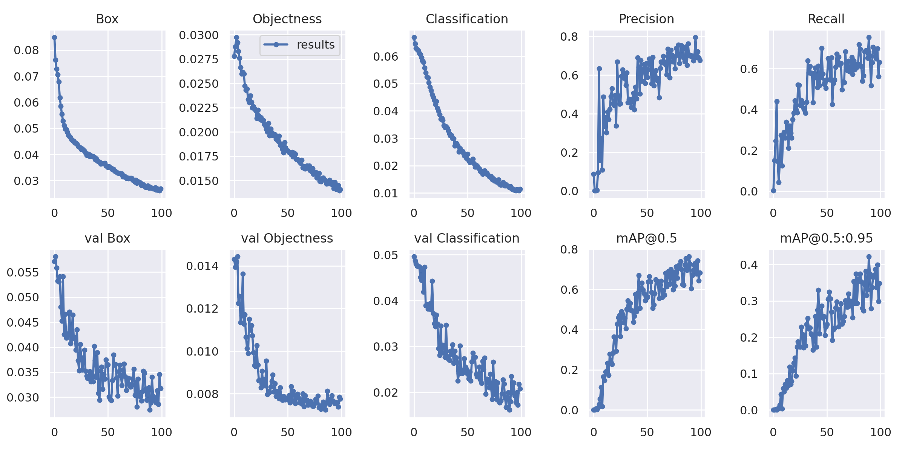

# Fashion_Classification

# I. Overview:
##### Based on provided train_data.csv contains imageas url_link and labels, building model that can classify what type of cloth in the picture.
 or you can find dataset which already annotated on [Deepfashion](http://mmlab.ie.cuhk.edu.hk/projects/DeepFashion.html) website.
#### 3. For training on your custom data, you can refer to the official tutorial [here](https://github.com/ultralytics/yolov5), higly recommended.
#### Or you can dowload my [best_weight.pt](https://drive.google.com/file/d/1JCo1QgVBDWJ_ZBjs087i3EDQx3Tl8mUT/view?usp=sharing) for transfer-learning. Remember to add the path to file weight in this command:
```
$ python train.py --img 640 --batch 16 --epochs 3 --data coco128.yaml --weights yolov5s.pt
```
# III. Evaluating:
#### Not only fast and convenient, what is better about yolov5? In the lastest version, it also embeded the function of autoatically drawing result evaluation.
Here what I get after 100 epochs
 .
 As you can see, the Recall score was not as good as I expected which meant my model still wrongly classified many classes, esp those with imbalance data.
 
  
 # IV. In the future:
 #### Add more images for  imbalanced categories such as: short-pant or vay-chong-nang.
 #### Use R-CNN or Faster R-CNN which forcus on benchmarks. I wonder whether the benchmarks can classify data better than bounding box method.
 #### Do research on how to distinguish clothes for men/women if they have similar shape, may be color, fabric or texture should be taken into account
 

 
